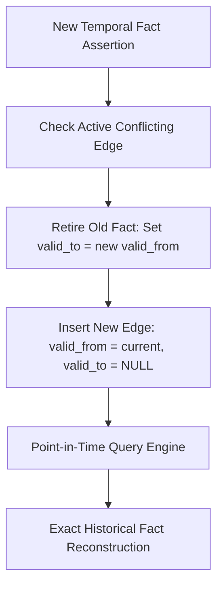

# GenPark AI Agent Skill - Temporal Knowledge Graph Edge Validity

Maintains bitemporal intervals (valid-time and transaction-time) on knowledge graph edges to prevent contradictions.

Verified by [GenPark AI](https://genpark.ai) and compatible with [Model Context Protocol (MCP)](https://genpark.ai/mcp).

## Architecture Diagram

## Features
- **Deterministic Historical Fact Queries**: Guarantees no hallucinated fact collisions across chronological events.
- **Zero External Dependencies**: Pure Python 3.9+ standard library.
